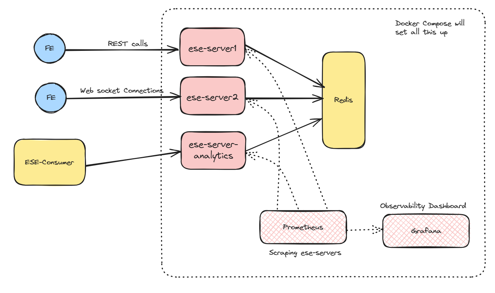

# ese-orchestration

This repo houses all the required configs as to how to orchestrate the FE, BE and other components for a demo.

**Frontend Stack :** React

**Backend Stack :** Go Server, Redis DB

**Infra Stack :** HAProxy LB, Docker containers

---

## Setting up Backend

We shall be using docker compose to set up the BE servers and the required monitoring. The purpose of each is described below.

| Image Name             | Endpoint                | Purpose                                                       |
| ---------------------- | ----------------------- | ------------------------------------------------------------- |
| `ese-server1`          | `http://localhost:2001` | This shard will only accept connections from the `ese-client` |
| `ese-server2`          | `http://localhost:2002` | This shard will only accept connections from the `ese-client` |
| `ese-server-analytics` | `http://localhost:2003` | This shard will only accept calls from the `ese-consumer`     |

Apart from the above mentioned ese-servers, the following containers will also be setup to facilitate the functionality and offer monitoring and observability.

| Image Name          | Endpoint                | Purpose                                                                                                                                        |
| ------------------- | ----------------------- | ---------------------------------------------------------------------------------------------------------------------------------------------- |
| `elb`               | `http://localhost:8100` | This is our Load Balancer for the ese-servers                                                                                                  |
| `redis-server`      | `http://localhost:6379` | This container will act as our data store to which all the `ese-server` connect to                                                             |
| `prometheus-server` | `http://localhost:9090` | This container will scrape the endpoint from the different `ese-server` containers that are running and store it in its time series data store |
| `grafana-server`    | `http://localhost:3000` | This container will act as our observability dashboard for all the ese-server                                                                  |

Our overall architecture for the BE would look as follows:



### Load Balancing

Shards `ese-server1` and `ese-server2` will be behind a HAProxy Load Balancer. The requests will be served based on the Least Connection algorithm.

The Load Balancer is exposed on `http://localhost:8100`. Real time stats of the connections at the load balancer could be found at `http://localhost:8100/stats`.

### Setting up the ESE-Servers

```bash
docker-compose -f ./docker/ese-server.compose.yml -p ese-backend up -d
```

This will setup 3 containers of the `ese-server` images. They will act as shards in our demo and provide the functionality explained above..

**Note :** In practice, each shard would have their own address. However since we are running all the containers on one machine using docker compose, all of them have the same bas URL.

### Setting up the observability

1. Once the above code is run, the grafana dashboard can be accessed at `http:localhost:3000`.
2. Provide the username and password as `admin`.
3. Choose prometheus as your data source and provide the URL: `http:prometheus-server:9090`
4. Choose the import dashboard option and upload the [ESE Server Grafana Dashboard.json](./observability/ESE%20Server%20Grafana%20Dashboard.json) file.

---

## Setting up Frontend

Once the BE is up and running, we can now connect the FE to it. Run the below given docker componse file. This will fire up 4 instance of the `ese-client` in simulation mode where it will emmit random click streams and order events to the BE with a delay of 300ms uptil 50,000 events have been emitted.

Remeber to set the correct environment variable for the ese-client to communicate with the ese-servers.

```bash
# setting environment variable in windows
($env:REACT_APP_BE_SERVER = "http://localhost:2001")

# setting environment variable in macOS
export REACT_APP_BE_SERVER=http://localhost:2001
```

```bash
docker-compose -f ./docker/ese-client.compose.yml -p ese-frontend up -d
```

---

## Setting up the Consumer

We have adashboard which will consume the live events sent from the FE via the BE. Run the below given command to start the consumer. This will open the dashboard on `http://localhost:8501`.

When asked to provide the data-source for live events, give the ese-server shard that we have made in the above usecase.

1. If you are running both the `ese-server` and the `ese-consumer` on the same machine, the URL would be : `http://host.docker.internal:2003/events`
2. If you are running the `ese-server` and the `ese-consumer` on different machine, fetch the Server URL from the below step.

```bash
docker run -it -p 8501:8501 --name ese-consumer saumyabhatt10642/ese-consumer
```

**Why is the URL for when both the server and consumer running on same machine `host.docker.internal` and not `localhost`?**

This is so because both of them are running on different Docker containers but are still on the same machine. Hence when consumer tries to access `localhost`, it will call the localhost of the container on which it is running. `host.docker.internal` bypasses this and directly calls the host machine.

---

## Connecting to BE

Since all of our ese-server containers are running on the same machine, their IP address is the same. Only the port on which they are running would differ. To get the IP address of your local machine, run the below given query, the result of which choose the broadcast IP address

```bash
ifconfig | grep netmask
```

The complete address of where your specific ese-server is running would thus be: `<ip address>:2003`
