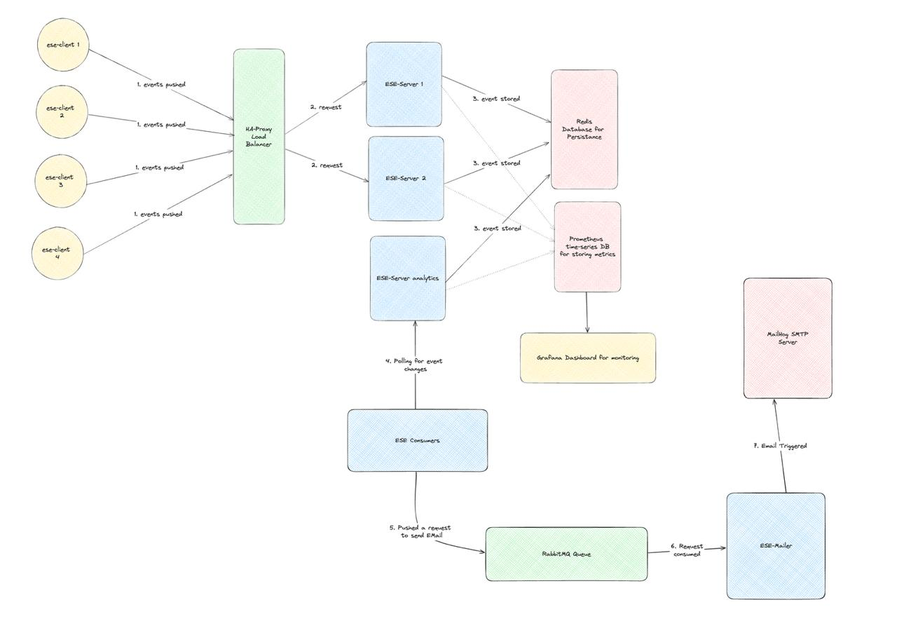

# ESE-Orchestration

This repo houses all the required configs as to how to orchestrate the FE, BE and other components for a demo. One can use this to understand how the overall architecure would look like.



## Quick Start

Execute the below given commands in order to setup all the components on a single machine. For more details about each component, view:

1. [ESE-Client](./client/README.md)
2. [ESE-Server](./server/README.md)
3. [ESE-Consumer](./consumer/README.md)
4. [ESE-Mailer](./mail/README.md)
5. [ESE-Kafka](./kafka/README.md)

```shell

# 1. Setting up the ese-mailer first
docker-compose -f ./mail/docker-compose.yml -p ese-mailer up -d

 # 2. Setting up the ese-server next
docker-compose -f ./server/docker-compose.yml -p ese-servers up -d

# 3. Starting Kafka entites. Set the IP to the one on which Kafka will run
export ESE_HOST_IP=192.168.29.191  && docker-compose -f ./kafka/docker-compose.yml -p ese-kafka up -d

 # 4. Setting up the ese-consumer next
docker run -d -p 8501:8501 --name ese-consumer saumyabhatt10642/ese-consumer

 # 5. Setting up a standalone ese-client
docker run -d -p 8080:80 --env-file ./client/.env --name ese-client-standalone saumyabhatt10642/ese-client

# 6. Setting up the simulation clients
docker-compose -f ./client/docker-compose.yml -p ese-clients up -d

```

## UI Hostings

If you are setting up all the components on the same machine, different UIs can be found as below.

| Address                       | Description         |
| ----------------------------- | ------------------- |
| <http://localhost:8080>       | Standalone Client   |
| <http://localhost:8100/stats> | Load Balancer Stats |
| <http://localhost:3000>       | Grafana Dashboard   |
| <http://localhost:8501>       | Consumer Dashboard  |
| <http://localhost:15672>      | Mailer Queue Stats  |
| <http://localhost:8025>       | Mailer Inbox UI     |
| <http://localhost:9090>       | Kafka UI            |

If some components are on a different machine, change the base URL to the machine's IP address. The port remains the same.

**Note:**

For the Kafka, let the `post-setup` container exit successfully before using any Kafka entities.
